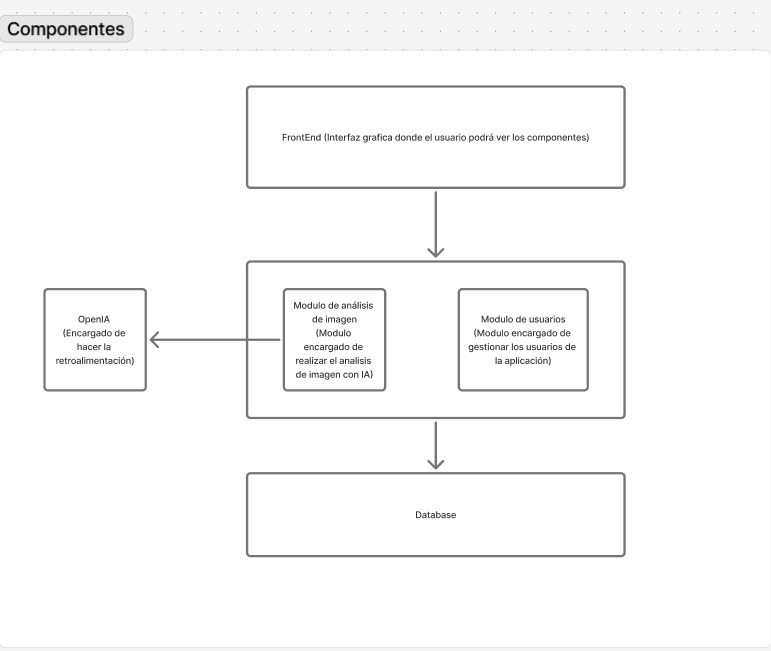

## Escuela Colombiana de Ingeniería

## Desafío Hackatón: "PixelScribe"

## Integrantes 

- 
-  
- 
- 

---

## Introduccion

PixelScribe es una plataforma web que combina la inteligencia artificial multimodal con una experiencia de usuario intuitiva para analizar imágenes y generar descripciones inteligentes.
El sistema permite que un usuario autenticado suba una imagen, la cual es procesada por un modelo de IA que analiza su contenido visual y devuelve información útil como una descripción textual, etiquetas (tags) y, en versiones avanzadas, el texto reconocido (OCR).
Cada análisis se almacena en una base de datos y puede visualizarse posteriormente en un dashboard personal, que sirve como galería de imágenes analizadas.

---

## Objetivos del Proyecto

#### Desarrollar una plataforma web funcional y segura que permita analizar imágenes mediante inteligencia artificial, brindando resultados estructurados y una experiencia de usuario fluida.

## Objetivos Específicos

1. **Autenticación Segura:** Implementar un sistema de registro e inicio de sesión basado en Auth0, garantizando el acceso seguro de los usuarios.

2. **Gestión de Imágenes:** Permitir la subida y almacenamiento de imágenes desde la interfaz web de manera sencilla.

3. **Análisis de IA:** Integrar una API de inteligencia artificial multimodal (como Gemini o GPT) para generar descripciones automáticas, etiquetas y texto OCR.

4. **Visualización de Resultados:** Mostrar en el dashboard del usuario sus imágenes procesadas junto con los resultados generados por la IA.

5. **Arquitectura Robusta (Categoría Senior):** Diseñar un sistema asíncrono y escalable con colas de procesamiento, notificaciones en tiempo real y contenedores dockerizados.

6. **Despliegue y Accesibilidad:** Asegurar que tanto el frontend como el backend estén desplegados públicamente en entornos accesibles, garantizando una experiencia de demostración fluida.

7. **Colaboración y Transparencia:** Mantener un flujo de trabajo colaborativo con commits frecuentes, ramas por funcionalidad y documentación clara del uso de herramientas de IA durante el desarrollo.

---

## Tecnologias

---

## Estructura del proyecto

---

## Arquitectura general del proyecto

### **Enfoque General: Monolito Modular**

PixelScribe está diseñado bajo una arquitectura monolítica modular, lo que significa que toda la aplicación (backend, lógica de negocio y comunicación con la base de datos) reside dentro de un mismo servicio desplegable, pero con una separación interna por dominios funcionales.
Este enfoque permite mantener la simplicidad del despliegue y la comunicación interna, al mismo tiempo que se garantiza una organización limpia del código y una escalabilidad futura hacia microservicios si el proyecto evoluciona.

La aplicación se estructura en módulos independientes, cada uno con responsabilidades claras:

**Módulo de Autenticación (Usuarios):** Gestionado mediante servicios REST.

**Módulo de Imágenes:** basado en eventos internos para el análisis y procesamiento asíncrono.

---

**Módulo de Autenticación (REST + Auth0)**

El área de autenticación y control de acceso se implementa utilizando Auth0, un proveedor externo de identidad que maneja todo el flujo de login, registro y gestión de usuarios.
Esto permite un enfoque seguro, escalable y conforme a estándares, eliminando la necesidad de manejar contraseñas directamente dentro del sistema.

**El flujo general es el siguiente:**

El usuario se autentica mediante Auth0 (usando email/password o proveedores externos como Google).

Auth0 genera un token JWT que contiene la identidad y permisos del usuario. El frontend envía este token al backend en cada solicitud protegida. El backend valida el token con Auth0 antes de permitir el acceso a los recursos o ejecutar acciones restringidas.

**El módulo REST del backend se encarga de:**

- Exponer los endpoints seguros para la aplicación. 
- Validar tokens y roles de usuario con las librerías oficiales de Auth0. 
- Gestionar la sesión y la autorización por roles o ámbitos (scopes).

---

**Módulo de Imágenes (Procesamiento por Eventos)**

El procesamiento y análisis de imágenes se implementa mediante un modelo basado en eventos.
Cuando un usuario sube una imagen, el backend emite un evento interno que desencadena los procesos de análisis de forma asíncrona, sin bloquear la experiencia del usuario.

**Este módulo se encarga de:**

- Almacenar la imagen y sus metadatos.

- Enviar la imagen a un servicio de IA multimodal (como Gemini o GPT) para su análisis.

- Recibir y procesar el resultado (descripción, etiquetas, OCR, etc.).

- Generar un nuevo evento (ImageAnalyzedEvent) que actualiza la base de datos y notifica al usuario.

El uso de eventos permite manejar múltiples análisis simultáneamente y escalar horizontalmente sin afectar el rendimiento del sistema principal.

## Componentes generales

